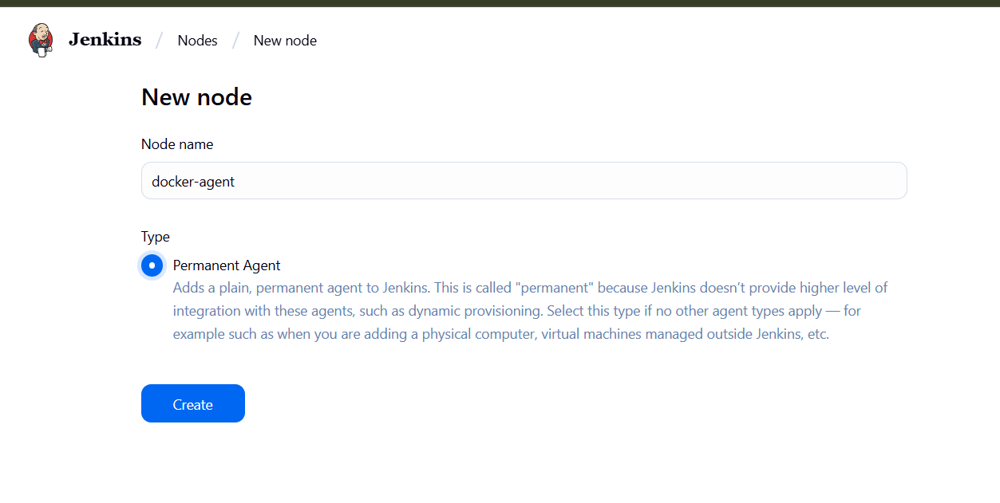

# JENKINS SETUP USING DOCKER 
<ol>

## <li> Create a docker network

```bash
sudo docker network create jenkins-network
```
</li>

## <li> CREATE JENKINS CONTAINER 
```bash
sudo docker run -d -p 8080:8080 -p 50000:50000 -v jenkins_home:/var/jenkins_home --name jenkins-master --network jenkins-network -u root jenkins/jenkins:lts
```

### NOW visit the [localhost:8080](http://localhost:8080/)
## You will be prompted for the password 

### FOR PASSWORD 
```bash
sudo docker logs jenkins-master
```

</li>

## SELECT > install suggested plugins


wait for some time .. until the installation is done 

## CREATE THE ADMIN USER 


## <li> CREATE SLAVE NODE
### CLICK ON SETTINGS 


### CLICK ON SETUP AGENT 




### FILL THE DETAILS 


#### FILL THE ENVIRONMENT VARIABLES


### CLICK > SAVE 


#### CLICK ON THE > DOCKER-AGENT

### COPY THE > SECRET KEY 


### CLICK ON CONFIGURE and SCROLL DOWN 
#### ADD AN ENVIRONMENT VARIABLE 
 
 #### CLICK SAVE 

</li>

## <li> CREATE AGENT CONTAINER

```bash 
sudo docker run -d --name jenkins-agent -e JENKINS_URL=http://jenkins-master:8080/ -e JENKINS_AGENT_NAME=docker-agent -e JENKINS_SECRET=<secret-key> --network jenkins-network -u root jenkins/inbound-agent
```

### get inside the container 
```bash
sudo docker exec -it jenkins-agent bash
```
### NOW ENTER THE COMMANDS 
```bash
curl -sO http://host.docker.internal:8080/jnlpJars/agent.jar
```

```bash
java -jar agent.jar -url http://host.docker.internal:8080/ -secret <secret-key> -name "docker-agent" -webSocket -workDir "/home/jenkins/agent"
```
</li>

## <li> CLICK ON THE BUILT-IN-NODE


## CONFIGURE > NUMBER OF EXECUTORS  | SET IT TO > 0 
</li>
</ol>